# 🧠 Cognitive-Reflex-Agent: Dual-Process AI Architecture

> **A robust agentic framework that thinks before it acts, and remembers what it learned.**

[](https://www.python.org/downloads/)
[](https://en.wikipedia.org/wiki/Thinking,_Fast_and_Slow)
[](https://modelcontextprotocol.io/)
[](https://deepmind.google/technologies/gemini/)

-----

## 📖 Executive Summary

Most autonomous agents suffer from two critical failures: **Inefficiency** (re-planning the same tasks repeatedly) and **Unreliability** (hallucinating API parameters).

**Cognitive-Reflex-Agent** solves this by implementing a **Dual-Process Theory** architecture:

1.  **Reflex (System 1):** A sub-millisecond **Semantic Cache** that recognizes intent via Jaccard similarity and returns historical answers instantly.
2.  **Reasoning (System 2):** A **Dynamic Python Planner** that generates, sanitizes, and executes valid Python code in a secure sandbox to solve novel problems.

This is not just a chatbot; it is a **runtime engine** that treats tools as function imports and plans as executable software.

-----

## 🏗️ System Architecture

The agent operates on a **Perceive-Plan-Act-Remember** loop, orchestrated by a central dispatcher that connects to external tools via the **Model Context Protocol (MCP)**.

```mermaid
flowchart TD
    User([User Input]) --> Router{Semantic Match?}
    
    %% System 1: Fast Path
    Router -- "Yes (Similarity > 0.9)" --> Recall[⚡ System 1: Memory Recall]
    Recall --> Output([Final Answer])
    
    %% System 2: Slow Path
    Router -- "No (Novel Task)" --> Perception[👁️ Perception Layer]
    
    subgraph System2 [System 2: Reasoning Engine]
        Perception --> Planner[📝 Code Planner]
        Planner --> Guard[🛡️ Heuristic Guardrails]
        
        Guard -- "Unsafe/Hallucination" --> Planner
        Guard -- "Approved" --> Sandbox[📦 Python Sandbox]
        
        Sandbox <--> MCP[🔌 Multi-MCP Dispatcher]
    end
    
    Sandbox -- "Success" --> Index[💾 Update Semantic Index]
    Index --> Output
    Sandbox -- "Error" --> Planner
```



-----

## 🛠️ Core Engineering Modules

### 1\. The Dynamic Planner (System 2)

Instead of asking the LLM to output a JSON list of tools to call, this agent asks the LLM to write a **Python program**.

  * **Why?** Code is expressive. It allows for loops, variable storage, and data transformation between tool calls.
  * **Mechanism:** The agent generates an `async def solve():` function.
  * **Safety:** The code is not `eval()`'d blindly. It is loaded into a restricted `types.ModuleType` environment where only specific, whitelisted MCP functions are injected.

### 2\. Semantic Memory & Caching (System 1)

To reduce token costs and latency, the system maintains a `historical_conversation_store.json`.

  * **Algorithm:** Uses **Jaccard Similarity** on normalized, stopword-stripped token sets.
  * **Logic:**
      * Query: *"What is the stock price of Tesla?"*
      * History: *"Current TSLA price"* (Similarity: 0.92) -\> **CACHE HIT**
  * **Result:** Responses for recurring queries drop from \~5 seconds (LLM inference) to **\<0.05 seconds** (Disk I/O).

### 3\. Multi-MCP Dispatcher

The architecture is tool-agnostic. It uses a **MultiMCP** class to aggregate tools from various servers (Math, Web Search, Filesystem) into a unified namespace for the planner.

  * **Protocol:** Standard Input/Output (stdio) communication ensures the agent can run local tools securely without exposing ports.

### 4\. Heuristic Guardrails

A deterministic logic layer that sits between the Planner and the Sandbox. It enforces 10 strict heuristics, including:

  * **PII Masking:** Detects credit card/SSN patterns before tool execution.
  * **Domain Whitelisting:** Prevents the agent from accessing restricted URLs.
  * **Complexity Budget:** Rejects plans that exceed a specific number of steps or token count.
  * **Hallucination Check:** Verifies that every tool called in the generated code actually exists in the current registry.

-----

## 📂 Project Structure

The codebase is organized to separate cognitive logic (Perception/Decision) from infrastructure (MCP/Session).

```text
Cognitive-Reflex-Agent/
├── agent.py                 # 🚀 CLI Entrypoint & Loop Controller
├── core/
│   ├── context.py           # State management (Session ID, Memory)
│   ├── loop.py              # The "Main Loop" logic
│   └── session.py           # MCP Client & Tool Dispatcher
├── modules/
│   ├── perception.py        # Intent classification & Server Selection
│   ├── decision.py          # LLM Code Generation (The Planner)
│   ├── action.py            # AST Sandboxing & Execution
│   ├── memory.py            # JSON Store & Semantic Indexing
│   └── heuristics.py        # 10 Hard-coded Safety Rules
└── config/
    ├── models.json          # LLM Configuration (Gemini/Ollama)
    └── profiles.yaml        # Agent Personality & Strategy Settings
```

-----

## ⚡ Quick Start

### Prerequisites

  * Python 3.10+
  * `uv` (recommended) or `pip`
  * Google Gemini API Key (or local Ollama setup)

### Installation

```bash
# 1. Clone the repository
git clone https://github.com/sushant097/Cognitive-Reflex-Agent.git
cd Cognitive-Reflex-Agent

# 2. Initialize environment
uv venv
source .venv/bin/activate

# 3. Install dependencies
uv pip install -e .

# 4. Configure Environment
export GEMINI_API_KEY="your_api_key_here"
```

### Running the Agent

```bash
uv run agent.py
```

**Example Interaction:**

```text
User: Find the latest news on SpaceX and summarize it.
Agent: [Perception] Selected Tools: Web Search, Text Processing
       [Planning] Generating Python code to search "SpaceX news" -> extract -> summarize.
       [Execution] Running sandbox...
       [Output] FINAL_ANSWER: SpaceX recently launched...
```

**Testing the Cache:**
Run the exact same query again.

```text
User: Find the latest news on SpaceX and summarize it.
Agent: ⚡ Semantic memory hit — returning cached FINAL_ANSWER.
```

-----

## 🧪 Technical Deep Dive: The `solve()` Sandbox

The security model relies on dynamic module generation. When the LLM generates a plan, we do not simply `exec` it in the global scope.

```python
# Simplified logic from modules/action.py
def run_python_sandbox(plan_code, tools):
    # 1. Create a fresh, empty module
    sandbox_module = types.ModuleType("agent_sandbox")
    
    # 2. Inject ONLY the necessary dependencies
    sandbox_module.mcp = SafeMCPWrapper(tools)
    sandbox_module.json = json
    
    # 3. Execute the definition to load the function
    exec(plan_code, sandbox_module.__dict__)
    
    # 4. Run the function
    return await sandbox_module.solve()
```

This prevents the agent from accessing `os`, `sys`, or the file system unless explicitly provided via an MCP tool.

-----

## 🔮 Roadmap

  * [ ] **Vector Database Integration:** Migrate from Jaccard/JSON to FAISS/Chroma for dense vector retrieval.
  * [ ] **Streaming Code Execution:** Execute Python lines as they are generated to reduce time-to-first-action.
  * [ ] **Human-in-the-Loop:** Add a middleware to pause execution for sensitive tool calls (e.g., `delete_file`).

-----

## 📜 License

Distributed under the MIT License. See `LICENSE` for more information.
