# 🧠 Cognitive-Reflex-Agent

> **A Dual-Process AI Architecture** implementing "System 1" (Semantic Memory) and "System 2" (Dynamic Planning). Features a secure AST-based sandbox, Jaccard-similarity caching, and Multi-MCP orchestration.

[](https://www.python.org/)
[](https://modelcontextprotocol.io/)
[](https://docs.python.org/3/library/asyncio.html)
[](https://www.google.com/search?q=)

-----

## 📖 Executive Summary

Building autonomous agents typically results in two failure modes: **High Latency** (re-reasoning common tasks) and **Unreliability** (hallucinating API parameters).

**Cognitive-Reflex-Agent** addresses these via a **Hybrid Architecture**:

1.  **Reflex (System 1):** A sub-millisecond **Semantic Cache** that recognizes intent via Jaccard similarity, bypassing the LLM entirely for recurring queries.
2.  **Reasoning (System 2):** A **Sandboxed Python Planner** that generates, sanitizes, and executes valid Python code in a restricted runtime to solve novel problems.

-----

## 🏗️ System Architecture

The agent operates on a **Perceive-Plan-Act-Remember** loop, using **AsyncIO** to manage non-blocking tool execution.

```mermaid
flowchart TD
    User([User Input]) --> Loop{Agent Loop}
    
    subgraph System1 [⚡ System 1: Reflex]
        Loop -- "Query" --> Cache[Semantic Cache]
        Cache -- "Sim > 0.8" --> Hit[Return Stored Answer]
    end
    
    subgraph System2 [🧠 System 2: Reasoning]
        Loop -- "Novel Task" --> Perception[Perception Module]
        Perception --> Planner[LLM Code Generator]
        Planner --> Sandbox[📦 Secure Python Sandbox]
        Sandbox <--> MCP[🔌 Multi-MCP Dispatcher]
    end
    
    Hit --> Output([Final Answer])
    Sandbox -- "Success" --> Memory[Update Index]
    Memory --> Output
```



-----

## 🔬 Engineering Deep Dive

### 1\. The Secure Runtime Sandbox (`action.py`)

**The Challenge:** Allowing an LLM to execute code is inherently dangerous. It risks infinite loops, file system destruction, or network abuse.

**The Solution:** Instead of `eval()`, I engineered a **Restricted Runtime Environment**. The agent generates a `solve()` function which is compiled into a temporary, isolated module scope.

```mermaid
sequenceDiagram
    participant Planner
    participant Sandbox as 📦 Sandbox Scope
    participant Dispatcher as 🛡️ Safe Dispatcher
    participant Tools as Real MCP Tools

    Planner->>Sandbox: Inject Python Code (solve)
    Note over Sandbox: Create new types.ModuleType<br/>Inject ONLY whitelisted tools
    Sandbox->>Sandbox: exec(compile(code))
    Sandbox->>Dispatcher: await solve()
    Dispatcher->>Dispatcher: Check Call Limit (Max 5)
    Dispatcher->>Tools: Execute Tool
    Tools-->>Sandbox: Return Result
```



  * **Isolation:** Uses `types.ModuleType` to create a fresh scope for every execution, preventing variable leakage.
  * **Call Guard:** The MCP client is wrapped in a proxy that enforces strict call limits (preventing `while True:` loops).
  * **Dependency Injection:** The LLM *thinks* it imports standard libraries, but the sandbox only injects safe, pre-configured wrappers.

### 2\. Semantic Cache & "System 1" Logic (`loop.py`)

**The Challenge:** LLM inference is slow (\~3s) and expensive. Re-answering the same question (e.g., "Tesla Stock Price") wastes tokens.

**The Solution:** A lightweight **Jaccard Similarity Engine** that acts as the agent's "Reflex". It compares the intersection of normalized tokens between the new query and the historical index.

```mermaid
graph LR
    A["New Query"] --> B("Tokenize & Stopword Removal")
    C["Historical Index"] --> D("Jaccard Comparison")
    B --> D
    D --> E{"Similarity > 0.8?"}
    E -- Yes --> F["⚡ Return Cached Answer (0.05s)"]
    E -- No --> G["🧠 Trigger LLM Planner (3.5s)"]
```



  * **Performance:** Reduces latency from **3.5s** to **\<0.05s** for recurring queries.
  * **Tunable:** The threshold is configurable in `profiles.yaml` (High Precision vs. High Recall).

### 3\. Self-Correcting In-Context Learning (`decision.py`)

**The Challenge:** Agents often forget tool schemas or syntax rules over long conversations.

**The Solution:** The system implements a **Feedback Loop**. Successful plans from the past are indexed and dynamically injected into the system prompt as "Few-Shot Examples" for future tasks.

  * **Mechanism:** If the user asks a question similar to a past success (but below the cache threshold), the planner receives the *exact Python code* that worked previously.
  * **Result:** The agent effectively "learns" from its own history, reducing hallucination rates significantly over time.

-----

## ⚙️ Configuration & Extensibility

The system is designed to be **config-driven**. The `profiles.yaml` file controls the cognitive architecture without changing code.

```yaml
# config/profiles.yaml
strategy:
  planning_mode: conservative    # strict adherence to tool definitions
  max_steps: 3                   # prevents infinite loops
  max_lifelines_per_step: 3      # self-correction retries

custom_config:
  jaccard_similarity_threshold: 0.80  # Sensitivity of System 1
  verbose_logging: true

mcp_servers:
  - id: math
    script: mcp_server_1.py
    capabilities: ["run_python_sandbox", "fibonacci"]
  - id: websearch
    script: mcp_server_3.py
    capabilities: ["duckduckgo_search_results"]
```

-----

## 📂 Project Structure

```text
Cognitive-Reflex-Agent/
├── agent.py                 # 🚀 CLI Entrypoint & Event Loop
├── core/
│   ├── session.py           # Multi-MCP Tool Dispatcher
│   └── loop.py              # The "System 1 vs System 2" Controller
├── modules/
│   ├── action.py            # 📦 The AST Sandbox Implementation
│   ├── decision.py          # LLM Planner & Prompt Engineering
│   └── memory.py            # Jaccard Indexing & Storage
└── config/
    └── profiles.yaml        # Strategy Configuration
```

-----

## 🚀 Getting Started

### Prerequisites

  * Python 3.11+
  * `uv` (recommended)
  * Gemini API Key (or local Ollama)

### Installation

```bash
git clone https://github.com/sushant097/Cognitive-Reflex-Agent.git
cd Cognitive-Reflex-Agent
uv venv && source .venv/bin/activate
uv pip install -e .
```

### Usage

```bash
uv run agent.py
```

**Make sure to create `.env` and put your `GEMINI_API_KEY`.**

**Example Interaction:**

```text
User: Find the latest news on SpaceX.
Agent: [System 2] Generating Python code...
       [Sandbox] Executing Search -> Extract -> Summarize...
       [Output] SpaceX successfully launched Starship...
```

**Testing the Cache:**

```text
User: Find the latest news on SpaceX.
Agent: [System 1] ⚡ Semantic memory hit (0.85 similarity).
       [Output] SpaceX successfully launched Starship...
```

## LICENSE
This project is licensed under the MIT License - see the [MIT LICENSE](LICENSE) file for details.